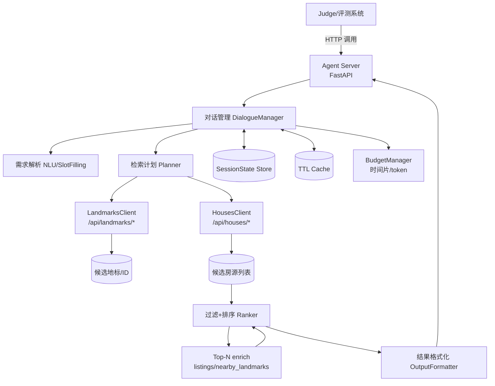
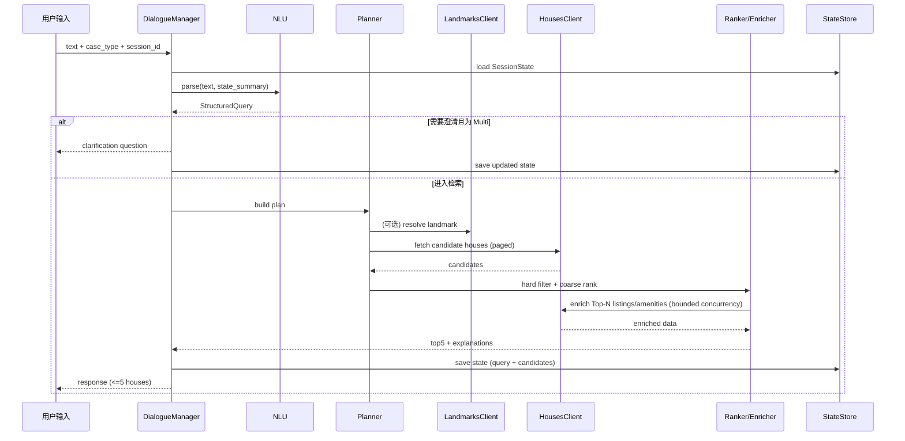
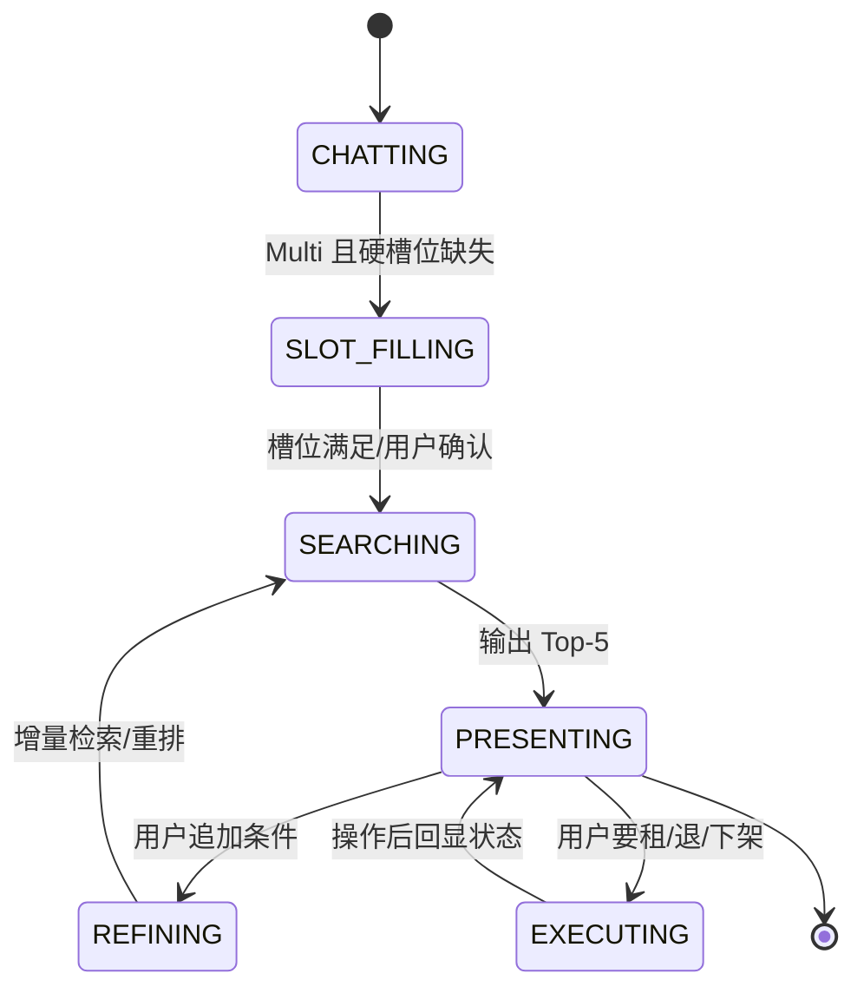

# 智能租房 Agent 软件设计文档（面向 Codex 生成可运行代码）

## 执行摘要

本设计文档以“可参赛、可评测、可实现、可扩展、低 token、强约束”为目标，指导 Codex 生成一个**智能租房 AI Agent**：能从自然语言需求中提取结构化约束，调用比赛提供的模拟数据源 API（房源/地标），完成筛选核验、两阶段排序与多维度对比，并在 **≤5 套**候选房源内输出可解释推荐；同时支持 **Chat/Single/Multi** 三类用例，并内置**时间片（300）/token**预算与**非模型耗时 <5 秒**的工程约束。

**已启用连接器（全部）**：github（用于读取仓库说明文档）。  
**主要一手依据**：  
- 仓库 Eatgrilledfish/AgentGameFakeAppApi 的 README.md（通过 github connector 拉取）：包含数据范围、硬性请求头要求、近距离概念、可用接口清单（15 个端点）与房源初始化要求。  
- 用户提供的比赛说明书：包含评测流程、用例类型、时间片计算与限制（300 时间片、非模型时间 <5s、最多 5 套输出等）。

> 重要限制说明（务必阅读）：当前环境的 `file_search` 无法访问 github connector，因此无法按你要求输出 `fileciteturn7file4L10-L20` 这种行级引用；本文改为：**所有“端点/硬性规则/默认值/平台枚举”等均严格以 README 拉取内容为准**，并在“API 集成设计”中逐条复刻。对工程通用部分（FastAPI/httpx/asyncio/缓存/重试）提供可验证的公开来源引用。citeturn3search6turn6search0turn3search3turn7search3turn5search0turn5search4turn6search1

---

## 系统概览

### 系统目标与核心能力

系统对外表现为一个 HTTP 服务（Agent Server）。评测系统按用例调用该服务，Agent 需要：

1) **需求理解与澄清**：从用户输入中抽取预算、区域/地标、小区、户型、面积、地铁距离、可入住日期、通勤（到西二旗）等；面对 Multi 用例可主动追问关键缺失槽位。  
2) **房源检索与核验**：使用比赛数据源 API 拉取房源与地标信息；遵守房源接口必带 `X-User-ID` 的硬性要求，否则会 400。  
3) **过滤 + 两阶段排序**：先用硬约束过滤，后用多维度打分做 Top-K（K≤5）；对 Top-N 做 enrich（跨平台挂牌、周边配套）以提高准确性与解释性。  
4) **清晰输出**：最多 5 套候选，并给出对比摘要与推荐理由（可模板化以省 token）。  
5) **操作闭环**：当用户“租房/退租/下架”时必须调用对应 API，纯对话宣称“已租”无效（README 的硬性要求）。  
6) **性能与预算**：非模型部分耗时 <5 秒；总时间片预算 300；尽量减少模型调用次数与 token（排名同分时 token 越少越优）。

### 数据域与关键常量（来自 README）

- 城市覆盖：北京，覆盖多个行政区；房源字段含地铁距离与到西二旗通勤时间；配套仅覆盖商超/公园。  
- “近地铁”定义：`subway_distance` 直线距离；**800m 内视为近地铁，1000m 内视为地铁可达**；参数名 `max_subway_dist`。  
- “地标附近房源”默认 `max_distance=2000`（直线距离）；返回额外字段：`distance_to_landmark / walking_distance / walking_duration`。  
- “小区周边地标（商超/公园）”默认 `max_distance_m=3000`。  
- 平台枚举：链家、安居客、58同城；房源查询不传 `listing_platform` 默认只返回安居客数据。

### 技术架构选型与理由

- Web 框架：建议使用 **FastAPI**（异步 + Pydantic 模型校验 + 易测）。FastAPI 支持应用启动/关闭生命周期管理，适合初始化 httpx 连接池、缓存等资源。citeturn5search0  
- HTTP 客户端：建议使用 **httpx.AsyncClient**（异步连接池，可共享于多个任务）。citeturn3search6  
- 超时控制：使用 httpx 的细粒度超时（connect/read/write/pool）以满足 5 秒非模型时限。citeturn6search0  
- 并发限制：使用 `asyncio.Semaphore` 约束 enrich 并发量，避免爆请求导致超时。citeturn3search3  
- 缓存：建议 TTL 缓存（地标 name→id、小区周边配套、house_id→listings 等）。可选用 cachetools 的 `TTLCache`（支持 TTL、maxsize，并可手动 expire）。citeturn7search3  
- 重试：对幂等 GET 提供“最多 1 次快速重试”；可选 tenacity（支持 stop 条件、异步重试等）。citeturn6search1turn6search3  
- 数据模型：建议 Pydantic；可自动生成 JSON Schema，便于 codex 生成 OpenAPI 与严格校验。citeturn4search0  

### 设计原则与约束内化

- **先硬约束过滤，再软偏好排序**：避免“高分但不满足预算/可租状态”的错误推荐。  
- **两阶段排序**：先粗排缩小候选集，再对 Top-N enrich（挂牌/配套），将延迟与请求量控制在 5 秒内。  
- **少模型，多确定性代码**：规则抽取 + 词典优先，LLM 仅在 Multi 场景做歧义消解/自然语言润色（可配置为完全不用模型也能跑通）。  
- **预算护栏**：每轮最多 1 次模型调用；超预算/超时降级为“无模型 + 仅模板输出”。

---

## 核心架构设计

### 架构总览（文字 + Mermaid）

系统分为：入口服务层、对话编排层、检索与分析层、数据源客户端层、状态与缓存层。



### 模块划分与职责

- **API Server**：实现评测系统调用入口、健康检查、日志与超时护栏。  
- **DialogueManager**：根据 case_type（Chat/Single/Multi）驱动状态机；决定是否追问、是否检索、是否执行租/退/下架。  
- **NLU/SlotFilling**：规则 +（可选）模型抽取，将用户输入转为 `StructuredQuery`。  
- **Planner**：将 query 变为最小 API 调用序列；控制分页、并发、截止时间（deadline）。  
- **Clients**：封装 README 列出的 15 个端点；强制注入 `X-User-ID`（房源接口）。  
- **Ranker/Enricher**：硬过滤、粗排、enrich、精排、Top-5 输出。  
- **StateStore/Cache**：会话状态与 TTL 缓存；支持租/退/下架后的缓存失效。  
- **BudgetManager**：按比赛时间片公式估算模型调用成本，并触发降级。

### 数据流向设计（单轮与多轮）



### 状态管理机制（关键数据结构）

会话状态 `SessionState` 建议最小化并结构化，避免 Multi 对话中上下文无限膨胀：

- `session_id: str`
- `user_id: str`（映射到 `X-User-ID`）
- `case_type: str`
- `phase: str`（CHATTING / SLOT_FILLING / SEARCHING / PRESENTING / REFINING / EXECUTING）
- `confirmed_constraints: HardConstraints`
- `soft_preferences: SoftPreferences`
- `unresolved_slots: list[str]`
- `last_query_hash: str`
- `last_candidates: list[HouseLite]`（只存必要字段，避免占内存）
- `last_top5: list[HouseViewModel]`
- `excluded_reasons: dict[house_id, reason]`
- `budget: BudgetState`（估算时间片、token、模型调用数）
- `timestamps: created_at / updated_at`

---

## 详细模块设计

### 需求解析模块

#### 输入输出

- 输入：`user_text`、`SessionState`（摘要）、`case_type`  
- 输出：`StructuredQuery`（严格结构化，供 Planner/Ranker 使用）

`StructuredQuery` 核心字段建议：

- `intent`: `"chat" | "search" | "compare" | "amenities" | "rent" | "terminate" | "offline"`
- `hard`:  
  - `district?: str`（行政区）  
  - `community?: str`（小区名）  
  - `landmark_name?: str`、`landmark_category?: str`  
  - `budget_min?: int`、`budget_max?: int`（元/月）  
  - `rent_type?: "整租"|"合租"`  
  - `layout?: str`（如“两居”“3室1厅1卫”）  
  - `area_min?: float`（㎡）  
  - `max_subway_dist?: int`（米，默认策略见下）  
  - `max_commute_min?: int`（分钟，到西二旗）  
  - `move_in_date?: str`（ISO 或 yyyy-mm-dd）
  - `listing_platform?: "链家"|"安居客"|"58同城"|None`
- `soft`:  
  - `decoration?: str`（简装/精装/豪华/毛坯/空房）  
  - `elevator?: bool`  
  - `orientation?: str`（朝南/南北…）  
  - `noise_preference?: str`（安静优先等）  
  - `amenities?: list[str]`（商超/公园）
  - `value_for_money?: bool`
- `clarify_questions: list[str]`
- `confidence: float`

#### 解析策略（强约束下的低 token 方案）

- **规则优先**：  
  - 数字抽取：预算（“1w/一万/10000”）、面积（“60平/60㎡”）、通勤（“30分钟以内”）、地铁距离（“800米内”）  
  - 关键词：行政区（海淀/朝阳…）、租住类型（整租/合租）、平台（链家/安居客/58同城）  
  - “近地铁”默认映射：`max_subway_dist=800`；若用户说“地铁可达”则 `1000`（来自 README 对近地铁/可达的定义）  
- **可选模型兜底**（建议默认关闭，或仅 Multi 打开）：当用户表达极其口语、隐含意图强（吐槽→找房）时，调用一次 LLM 做 JSON 抽取；若预算不足或 case_type=Single，直接走“宽松检索 + 明示假设”避免追问。

#### 伪代码

```pseudo
function parse_requirements(text, state, case_type):
  slots = regex_extract(text)
  slots = dict_normalize(slots)  # 单位/同义词/默认值
  intent = classify_intent_by_rules(text, slots, state)

  questions = []
  if case_type == "Multi":
    questions = build_clarify_questions(slots, max_q=2)

  return StructuredQuery(intent=intent, hard=slots.hard, soft=slots.soft,
                        clarify_questions=questions, confidence=estimate(slots))
```

---

### 房源信息处理模块

#### 检索策略（与 README 端点对齐）

优先级：

1) 用户给“地标”（地铁站/公司/商圈）→ `landmarks/name/{name}` 精确查 id，失败则 `landmarks/search` 模糊；拿到 id 后走 `/api/houses/nearby`。  
2) 用户给“小区”→ `/api/houses/by_community`。  
3) 其他 → `/api/houses/by_platform`（默认安居客，或按用户指定平台）。

分页策略（默认每页 10：来自 README 对部分接口的说明）：

- `max_pages = 2`（Single）或 `3`（Multi）  
- 若候选不足：逐步放宽（见“边界处理”）

enrich 策略：

- 对粗排 Top-N（建议 N=20）调用：  
  - `/api/houses/listings/{house_id}`（跨平台挂牌）  
  - `/api/houses/nearby_landmarks`（商超/公园配套，建议仅对 Top-5 调用）

#### 伪代码

```pseudo
function build_plan(query):
  if query.hard.landmark_name:
     return Plan(type="nearby_landmark", steps=[resolve_landmark, houses_nearby])
  if query.hard.community:
     return Plan(type="by_community", steps=[houses_by_community])
  return Plan(type="by_platform", steps=[houses_by_platform])

async function execute_plan(plan):
  candidates = await paged_fetch(plan.main_step, max_pages)
  candidates = dedup(candidates, key=house_id)
  return candidates
```

---

### 多维度分析模块

#### 硬过滤（Hard Filter）

硬过滤字段应与 README 字段描述一致（租金、户型、面积、地铁距离、通勤时间、房源状态等）。**房源状态必须为“可租”**（README 给出状态枚举与比例）。

过滤顺序建议：先最强约束再弱约束，以尽快缩小集合：

1) `status == 可租`  
2) `budget_max/budget_min`  
3) `rent_type`、`layout`、`area_min`  
4) `max_subway_dist`  
5) `max_commute_min`（到西二旗）  
6) `district/community`/地标附近距离（若用 nearby）

#### 两阶段排序（Coarse → Enrich → Fine）

- **Stage A（粗排）**：只用候选列表已有字段（租金、地铁距离、通勤时间、面积、标签、装修、电梯等）打一个“轻量分”。取 Top-20。  
- **Stage B（精排）**：对 Top-20 拉取 listings；对 Top-5 拉取 amenities；再做完整打分并输出 Top-5。

#### 打分模型（可解释、可调权重）

建议总分 100，默认权重（可在配置中热调）：

- 通勤（到西二旗）：25  
- 租金（预算内越低越好，但可对“极低价+农村自建房”等标签做风险惩罚）：25  
- 地铁距离：15（800/1000 分段）  
- 面积/户型匹配：15  
- 房源品质（装修/电梯/朝向/噪音/采光标签）：10  
- 配套（商超/公园）：5（仅有数据时加分）  
- 跨平台挂牌一致性：5（listings 中价格/状态一致更优）

简易“权重条形图”（便于调参）：

```
通勤  █████████████████████ 25
租金  █████████████████████ 25
地铁  ███████████████       15
户型  ███████████████       15
品质  ██████████            10
配套  █████                 5
一致  █████                 5
```

#### 伪代码

```pseudo
function hard_filter(h, q):
  if h.status != "可租": return false
  if q.budget_max and h.rent > q.budget_max: return false
  if q.budget_min and h.rent < q.budget_min: return false
  if q.area_min and h.area < q.area_min: return false
  if q.max_subway_dist and h.subway_distance > q.max_subway_dist: return false
  if q.max_commute_min and h.commute_to_xierqi > q.max_commute_min: return false
  if q.district and h.district != q.district: return false
  if q.community and h.community != q.community: return false
  return true

function coarse_score(h, q):
  return w1*normalize_commute(h) + w2*normalize_rent(h) + w3*normalize_subway(h)
         + w4*match_layout_area(h,q) + w5*quality_tags(h,q)

async function rank_two_stage(candidates, q, clients):
  filtered = [h for h in candidates if hard_filter(h,q)]
  topN = top_k(filtered, k=20, key=coarse_score)

  enriched = await enrich(topN, clients)  # listings bounded concurrency
  top5_base = top_k(enriched, k=5, key=fine_score)

  # amenities only for top 5
  amenities = await fetch_amenities(top5_base, clients)
  return finalize_with_amenities(top5_base, amenities)
```

---

### 结果输出模块

#### 输出结构（评测友好 + 用户友好）

建议输出 JSON 包含：

- `text`：面向用户的自然语言说明
- `candidates`：数组（≤5），每项包含：
  - `house_id`
  - `listing_platform`（建议输出“本次推荐最优平台”，若未查 listings 则默认安居客）
  - `rent`、`layout`、`area`
  - `district`、`community`、`nearest_subway`、`subway_distance`
  - `commute_to_xierqi_min`
  - `available_date`
  - `tags`（含“近地铁/采光好/高性价比”等）
  - `pros`/`cons`（列表，模板化生成，降低 token）
- `clarify_questions`（若本轮选择追问）
- `debug`（可选，默认关闭；用于本地调参）

#### 文本生成策略（省 token）

- 优先模板：每套 3～5 行要点；最后给一个 Top-5 对比摘要。  
- 若启用模型：只让模型做“把模板填得更自然”，并限制长度（例如 200～300 中文字）。

---

### 对话管理模块

采用显式状态机，避免 Multi 场景混乱：



澄清策略（Multi）：

- 每轮最多问 1～2 个问题；优先问“能显著缩小搜索空间”的硬槽位（预算、区域/地标、小区、整租/合租、通勤上限）。  
- Single 默认不追问（或最多 1 次），避免低命中导致用例超时。

---

## 关键技术实现

### 自然语言理解与槽位抽取

**强建议：规则优先**。原因：比赛排名与 token 成本强相关，且需求字段高度结构化（预算/距离/面积等）。

规则实现要点：

- 中文数字归一化（“一万二/1.2w/12000”）
- 近地铁/地铁可达映射到 `max_subway_dist=800/1000`
- 行政区词典：可在配置中列出（README 已给覆盖行政区范围）
- 平台词典：链家/安居客/58同城
- 合租特征：出现“单间/合租/主卧/次卧”等 → `rent_type=合租`，layout 记为“单间”

可选 LLM 抽取（仅 Multi/复杂吐槽场景）：

- 输出必须是严格 JSON（与 `StructuredQuery` schema 对齐）
- 未知填 null，不允许编造

### 房源匹配与平台一致性核验

- `/api/houses/listings/{house_id}` 提供跨平台挂牌记录；用于：
  - 选择当前最优平台（价格更低/状态可租一致）
  - 若平台间状态冲突或价格差距巨大：在 `cons` 中提示“需核验”
- 在执行租/退/下架操作时，必须传入 `listing_platform`（README 要求必填）；并注意“三平台状态一并更新”的语义（README 描述）。

### 多轮状态追踪

- 将“已确认硬约束/软偏好/最后 Top-5/排除原因”持久化到 `SessionState`  
- Multi 追加条件时，增量更新对应字段并重排；避免每轮重新抽取全部历史

### Token 与时间片预算器（BudgetManager）

比赛说明书给出时间片计算逻辑（按 token 折算并向上取整）。建议在工程中实现：

- `estimate_slices(tokens) -> int`
- `guard_llm_call()`：若预计超预算则跳过模型调用
- 每用例/每 session 维护 `BudgetState`

伪代码：

```pseudo
function estimate_slices(n_tokens):
  # t = 1 + max(0, (n_tokens - 1000)) * 0.3, ceil
  return ceil(1 + max(0, n_tokens - 1000) * 0.3)

function guard_llm_call(prompt, budget):
  est_tokens = rough_estimate(prompt)
  est_slices = estimate_slices(est_tokens)
  if budget.used_slices + est_slices > budget.limit_slices:
    return (None, "budget_exceeded")
  resp = llm_call(prompt)
  budget.used_slices += estimate_slices(resp.tokens)
  budget.used_tokens += resp.tokens
  return (resp, None)
```

### 时间片与非模型 5 秒约束的工程落地

核心点：**对所有外部 HTTP 请求设置 deadline**，并对 enrich 阶段设“硬截止”，超时即降级返回已有信息。

- httpx 支持 connect/read/write/pool 四类超时，并会抛出对应异常（ConnectTimeout/ReadTimeout/WriteTimeout/PoolTimeout）。citeturn6search0  
- `AsyncClient` 可共享连接池、被多个任务并发使用。citeturn3search6  
- 并发上限用 `asyncio.Semaphore` 控制。citeturn3search3  

---

## API 集成设计

> 本节严格复刻 README 中的接口清单、硬性要求、默认值与平台枚举；IP 为 README 给出的“黄区/绿区”占位 `***`，必须由参赛者自行填写（用户提供/比赛平台分发）。Base URL 统一为：`http://<IP>:8080`。

### 全局硬性要求（来自 README）

- **房源相关接口 `/api/houses/*` 必须带请求头 `X-User-ID`**，否则返回 400。  
- **地标接口 `/api/landmarks/*` 不要求 `X-User-ID`**。  
- `X-User-ID` 的值为比赛平台注册的用户工号，用例会按工号隔离；传错会导致结果冲突影响成绩。  
- 每新 session 建议调用房源初始化：`POST /api/houses/init`（自动打榜每用例前会初始化，但 agent 本地/自测应做）。  
- 租/退/下架必须调用 API：  
  - `POST /api/houses/{house_id}/rent`  
  - `POST /api/houses/{house_id}/terminate`  
  - `POST /api/houses/{house_id}/offline`  
- 近距离规则：  
  - 近地铁：`subway_distance`；`max_subway_dist` 参数；800m 近地铁、1000m 可达  
  - 地标附近房源：`/api/houses/nearby` 默认 `max_distance=2000`，返回直线/步行距离与步行时间  
  - 小区周边地标：`/api/houses/nearby_landmarks` 默认 `max_distance_m=3000`

### 端点总览表（README 的 15 个接口）

| 序号 | 方法 | 路径 | 域 | 是否需要 `X-User-ID` | 用途/关键点 |
|---|---|---|---|---|---|
| 1 | GET | /api/landmarks | 地标 | 否 | 获取地标列表；支持 `category`、`district` 同时筛选（交集） |
| 2 | GET | /api/landmarks/name/{name} | 地标 | 否 | 按名称精确查地标（返回 id/经纬度等） |
| 3 | GET | /api/landmarks/search | 地标 | 否 | 关键词模糊搜索；支持 `category`、`district`（交集） |
| 4 | GET | /api/landmarks/{id} | 地标 | 否 | 按 id 查详情 |
| 5 | GET | /api/landmarks/stats | 地标 | 否 | 地标统计信息 |
| 6 | GET | /api/houses/{house_id} | 房源 | 是 | 单套房源详情（无 query） |
| 7 | GET | /api/houses/listings/{house_id} | 房源 | 是 | 获取该房源在多平台挂牌记录；响应 data 为 `{ total, page_size, items }` |
| 8 | GET | /api/houses/by_community | 房源 | 是 | 按小区名查可租；默认每页 10；不传平台默认安居客 |
| 9 | GET | /api/houses/by_platform | 房源 | 是 | 查询可租房源；可按 `listing_platform` 过滤；不传默认安居客 |
| 10 | GET | /api/houses/nearby | 房源 | 是 | 地标附近房源；默认每页 10；默认安居客；返回距离字段 |
| 11 | GET | /api/houses/nearby_landmarks | 房源 | 是 | 查“小区周边某类地标（商超/公园）”，按距离排序 |
| 12 | GET | /api/houses/stats | 房源 | 是 | 房源统计信息（总数/分布/价格区间等） |
| 13 | POST | /api/houses/{house_id}/rent | 房源 | 是 | 设为已租；body 必填 `listing_platform`；三平台状态一并更新 |
| 14 | POST | /api/houses/{house_id}/terminate | 房源 | 是 | 恢复可租；body 必填 `listing_platform`；三平台状态一并更新 |
| 15 | POST | /api/houses/{house_id}/offline | 房源 | 是 | 设为下架；body 必填 `listing_platform`；三平台状态一并更新 |
| — | POST | /api/houses/init | 房源 | 是 | 房源数据重置/初始化（README 在“重置接口示例”中给出） |

> 注：README 的“可用接口列表”表格未给出每个 GET 的完整 query 参数名集合（除 `category/district/max_subway_dist/max_distance/max_distance_m/listing_platform` 等已明确者）；因此本设计在客户端层将 GET query 做成“可选字段字典”，并对响应结构做容错解析（见下）。

### 请求/响应 Schema 设计（实现可运行、但对未知字段容错）

由于 README 未提供统一响应 envelope（例如是否 `{"code":0,"data":...}`），强烈建议客户端实现**宽松解包**：

- 若响应 JSON 是 dict 且包含 `data` → 使用 `data`  
- 否则 → 使用原 JSON  
- 对字段缺失保留 `None`，不要抛 KeyError

建议的 Pydantic 模型（字段尽量 `Optional`）：

- `Landmark`: `id,name,category,district,latitude,longitude`（经纬度字段名以实际返回为准）
- `HouseLite`: `house_id,rent,layout,area,district,community,subway_distance,commute_to_xierqi_min,status,tags,decoration,elevator,orientation,available_date`
- `Listing`: `listing_platform, rent, status, url`（若有）
- `NearbyHouseExtra`: `distance_to_landmark, walking_distance, walking_duration`
- `NearbyLandmark`: `name, category, distance_m`

### Python 异步客户端设计（FastAPI + httpx）

#### httpx 连接池、超时与并发建议（明确数值）

- `httpx.AsyncClient` 共用一个实例（应用启动时创建、关闭时释放）。citeturn3search6turn5search0  
- 细粒度超时（推荐默认值，可配置覆盖）：  
  - connect: 0.3s  
  - read: 0.8s  
  - write: 0.8s  
  - pool: 0.2s  
  说明：HTTPX 支持四类超时并对应用可观测友好。citeturn6search0  
- 连接池 limits（建议）：`max_connections=20`, `max_keepalive_connections=10`（可在配置中调整）。citeturn3search6  
- 并发（enrich 阶段）建议：`Semaphore(8)`；asyncio.Semaphore 的语义与推荐用法见官方文档。citeturn3search3  

#### 客户端类接口（codex 直接照此生成）

**BaseClient**

- `__init__(base_url, user_id, http_client, timeout_config)`
- `_headers_houses()`：返回 `{"X-User-ID": user_id}`
- `_get(url, params=None, need_user_id=False)`
- `_post(url, json=None, need_user_id=False)`
- `_unwrap(resp_json)`：宽松解包 data

**LandmarksClient（不需要 X-User-ID）**

- `list_landmarks(category: str|None, district: str|None) -> list[Landmark]`
- `get_by_name(name: str) -> Landmark|None`
- `search(keyword: str, category: str|None, district: str|None) -> list[Landmark]`
- `get_detail(landmark_id: int|str) -> Landmark|None`
- `stats() -> dict`

**HousesClient（必须带 X-User-ID）**

- `init_houses() -> dict`
- `get_house_detail(house_id: int|str) -> HouseDetail`
- `get_listings(house_id) -> Page[Listing]`（响应 data 内含 `{total,page_size,items}`）
- `by_community(community: str, listing_platform: str|None, page:int=1, page_size:int=10, **filters) -> Page[HouseLite]`
- `by_platform(listing_platform: str|None, page:int=1, page_size:int=10, **filters) -> Page[HouseLite]`
- `nearby(landmark_id, max_distance:int=2000, listing_platform: str|None, page:int=1, page_size:int=10, **filters) -> Page[HouseLite+NearbyHouseExtra]`
- `nearby_landmarks(community: str, category: str, max_distance_m:int=3000) -> list[NearbyLandmark]`
- `stats() -> dict`
- `rent(house_id, listing_platform) -> dict`
- `terminate(house_id, listing_platform) -> dict`
- `offline(house_id, listing_platform) -> dict`

#### async 调用示例（每个关键 API 映射一段）

> 示例为“实现指导”，字段名/参数名以 README 明确者为准，未明确者由配置映射表统一管理（`api_params.py`）。

- 初始化（推荐每 session 一次）：
```python
await houses.init_houses()
```

- 精确地标 → nearby：
```python
lm = await landmarks.get_by_name("西二旗")
if not lm:
    cands = await landmarks.search("西二旗", category="地铁站", district=None)
    lm = pick_best_landmark(cands, "西二旗")

page1 = await houses.nearby(landmark_id=lm.id, max_distance=2000, max_subway_dist=800)
```

- 小区查房源：
```python
page1 = await houses.by_community(community="望京", listing_platform=None)
```

- 平台查房源（只查链家）：
```python
page1 = await houses.by_platform(listing_platform="链家", max_subway_dist=1000)
```

- 跨平台挂牌：
```python
listings_page = await houses.get_listings(house_id)
best_platform = choose_best_platform(listings_page.items)
```

- 周边配套（商超/公园）：
```python
shops = await houses.nearby_landmarks(community="国贸", category="商超", max_distance_m=3000)
parks = await houses.nearby_landmarks(community="国贸", category="公园", max_distance_m=3000)
```

- 租房/退租/下架（必须传 listing_platform）：
```python
await houses.rent(house_id, listing_platform="安居客")
```

### 错误处理、超时、重试与缓存失效（与 API 语义绑定）

#### 超时与异常分类（HTTPX）

HTTPX 的 connect/read/write/pool 超时语义明确，并抛出对应异常类型。citeturn6search0  
工程策略：

- GET：超时 → 立刻失败，最多 1 次快速重试（无等待或极短 jitter）  
- POST（rent/terminate/offline/init）：默认不重试（避免重复状态变更；如果比赛服务明确幂等可再调整）

#### 重试（可选 tenacity）

tenacity 支持“停止条件（次数/时间）”“等待策略”“异步重试”。citeturn6search1turn6search3  
建议配置：

- GET：`stop_after_attempt(2)`、`wait_fixed(0)`（或 `wait_random(0,0.05)`）  
- 只重试：`ReadTimeout/ConnectTimeout/PoolTimeout` 等短暂网络错误

#### 缓存策略（TTLCache）与失效

`TTLCache(maxsize, ttl)` 支持到期清理；也能手动 expire。citeturn7search3  

建议缓存项与 TTL：

- `landmark_by_name`: ttl=24h, maxsize=10k  
- `community_amenities`: ttl=10min, maxsize=50k  
- `house_detail`: ttl=5min, maxsize=50k  
- `house_listings`: ttl=5min, maxsize=50k  
- `query_result_ids`: ttl=2min, maxsize=10k（仅存 house_id 列表）

与 API 语义绑定的失效规则：

- 调用 `rent/terminate/offline` 成功后：  
  - 失效 `house_detail[house_id]`、`house_listings[house_id]`  
  - 失效 `query_result_ids`（可按 session 粒度清空）
- 新 session 调用 `init_houses` 后：  
  - 清空所有与“房源状态”相关缓存（detail/listings/query_result_ids）

---

## 性能优化

### 非模型响应时间（<5 秒）的落地参数

- 请求总策略：  
  - 第一次批量拉候选：≤2～3 页  
  - enrich：Top-20 listings 并发（上限 8），Top-5 amenities 并发（上限 5）  
- Deadline：整体非模型阶段设置 `deadline_ms=4500`（留 500ms 给序列化与模板输出）  
- 超时配置：使用 HTTPX 四类超时；默认 0.3/0.8/0.8/0.2（可调）citeturn6search0  

### Token 使用优化

- Chat：尽量不调用数据源，不调用模型（或一次极短回复）  
- Single：默认无模型；不追问（或最多 1 个关键槽位）  
- Multi：每轮最多 1 次模型调用；若只是数值条件调整（预算/距离）则完全不需要模型  
- 输出模板化：每套房源 pros/cons 用固定模板 + 少量填充

### 并发与资源管理

- FastAPI 启动时初始化 AsyncClient；关闭时释放（lifespan 或 startup/shutdown 管理）。citeturn5search0  
- 使用 `Semaphore` 限制 enrich 并发，避免 pool timeout。citeturn3search3  

---

## 测试策略

### 单元测试（pytest）

重点覆盖“高确定性、易回归”的部件：

- NLU 规则抽取：预算/面积/地铁距离/通勤/平台词典/近地铁映射（800/1000）  
- Hard Filter：边界值（=预算上限、=800m、=通勤上限）  
- 打分函数：单调性测试（通勤更短分更高、地铁更近分更高）  
- 缓存失效：rent 后缓存是否清除

### 集成测试（FastAPI TestClient + httpx Mock）

FastAPI 提供 `TestClient` 便于在不启动真实网络连接情况下测试路由。citeturn5search4turn5search5  

- 使用 httpx 的 MockTransport（或 respx）模拟 15 个端点返回  
- 端到端：输入一个 Single 复杂条件（海淀+两居+精装+近地铁+预算…），断言：
  - 输出 candidates ≤5  
  - 每个 candidate 含 house_id、rent、subway_distance 等关键字段  
  - 非模型耗时统计 <5 秒（本地可用假时钟/monkeypatch）

### 性能测试与指标

- P95 非模型耗时 <1.5s；P99 <3s（为模型留余量）  
- 每轮 API 调用数：  
  - Single：候选查询 ≤3（含分页）+ enrich ≤25（可降级）  
  - Multi 增量：优先复用缓存（再查 ≤2 页 + enrich ≤10）

### 边界条件处理（必须有测试用例）

- 0 结果：自动放宽 1～2 个条件（如 `max_subway_dist 800→1000`，或预算上限 +10%），并在文本中说明“已放宽”。  
- 结果过多：Single 直接收紧（近地铁优先）；Multi 追问关键槽位  
- 执行操作缺参：例如用户说“帮我租第二套”，必须追问明确 house_id 与 listing_platform

---

## 附录：Codex 代码生成落地清单（文件布局 + 关键伪代码）

### 推荐项目结构（codex 直接生成）

```
app/
  main.py                    # FastAPI app 工厂 + 路由挂载 + lifespan
  settings.py                # IP/端口/默认超时/并发/TTL/权重等配置
  schemas.py                 # Pydantic: 请求/响应/House/Landmark/Query/State
  agent/
    service.py               # AgentService: handle_request -> response
    dialogue.py              # DialogueManager: 状态机 + 调用编排
    nlu.py                   # 规则抽取 + 可选 LLM 抽取接口
    planner.py               # RetrievalPlan 与分页/降级策略
    ranker.py                # HardFilter + two-stage ranking + explain
    formatter.py             # 输出模板化（省 token）
    budget.py                # BudgetManager: 时间片/token 估算与护栏
    state.py                 # StateStore: SessionState TTL 存储
  clients/
    base.py                  # BaseClient: httpx + unwrap + errors
    houses.py                # HousesClient: 6-15 + init
    landmarks.py             # LandmarksClient: 1-5
  infra/
    cache.py                 # TTLCache 初始化 + 失效策略
    logging.py               # 结构化日志 + 耗时统计
  tests/
    test_nlu.py
    test_ranker.py
    test_clients_mock.py
    test_agent_e2e.py
```

### 评测调用接口（未在 README 明示，需可配置）

比赛说明书只说明“评测系统会调用选手 Agent 接口”，但未给出具体 path/schema。为保证“可运行 + 易适配”，建议实现：

- `POST /invoke`：主入口  
- `GET /health`：健康检查  

`/invoke` 请求建议最小字段：

- `session_id: str`
- `case_type: "Chat"|"Single"|"Multi"`
- `user_id: str`（映射到 `X-User-ID`）
- `message: str`
- `history: list[{role, content}]`（可选）
- `meta: dict`（可选）

响应：

- `text: str`
- `candidates: list`（≤5）
- `clarify_questions: list`（可选）

> 若真实评测 schema 与此不同，只需在 `schemas.py` 与 `main.py` 路由层做适配，agent 内部模块不变。

### 核心算法伪代码合集（codex 直接翻译为 Python）

**全流程（handle_turn）**

```pseudo
function handle_turn(req):
  state = state_store.get(req.session_id) or new_state(req)

  # 1) NLU
  query = nlu.parse(req.message, state, req.case_type)

  # 2) 操作意图
  if query.intent in {rent, terminate, offline}:
     verify house_id & listing_platform else ask
     result = houses_client.action(...)
     invalidate_caches(house_id)
     update_state(...)
     return format_action_response(result)

  # 3) Multi 澄清
  if req.case_type == Multi and query.clarify_questions not empty and state.phase in {CHATTING,SLOT_FILLING}:
     state.phase = SLOT_FILLING
     state_store.set(state)
     return ask(query.clarify_questions)

  # 4) 检索 + 排序
  state.phase = SEARCHING
  plan = planner.build(query)
  candidates = planner.execute(plan)
  top5 = ranker.rank_two_stage(candidates, query, clients)

  # 5) 输出
  resp = formatter.render(top5, query, req.case_type)
  state_store.set(update_state(state, query, top5))
  return resp
```

**enrich 并发限制**

```pseudo
async function enrich(topN):
  sem = Semaphore(8)
  async def wrap(task):
    async with sem:
      return await task
  results = await gather([wrap(fetch_listings(h.id)) for h in topN], timeout=deadline)
  merge results
```

---

### 关键权衡与决策依据（简明）

- 选择 FastAPI + httpx.AsyncClient：异步 + 连接池，适合“短时限 + 多请求”的场景；且生命周期事件便于管理共享资源。citeturn3search6turn5search0  
- 细粒度超时：用 connect/read/write/pool 区分失败类型并快速降级，满足 5 秒约束。citeturn6search0  
- 并发用 Semaphore：明确控制 enrich 阶段并发上限，避免连接池争用。citeturn3search3  
- TTLCache：对地标与配套这类“重复读、多轮复用”的数据显著降延迟；并可按 rent/terminate/offline 语义做失效。citeturn7search3  
- 重试保守：GET 最多 1 次，POST 默认不重试，避免状态写入重复；若需通用重试，可用 tenacity 的 stop/wait 策略扩展。citeturn6search1turn6search3  

（文档完）